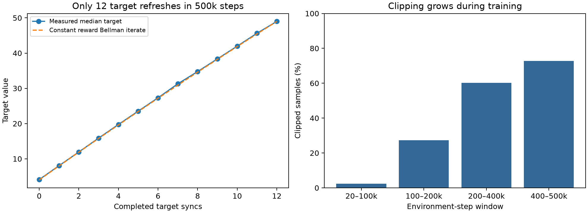

# DDQN seed diversity and architecture follow-up

## Latest implementation and experiment constraints

Both 500k A100 seed-pool runs are now collected locally; the assignment was
released. On the same 128 held-out scenarios, the 700-seed run averaged 348.94
reward (349.94 survival frames), versus 264.49 reward (265.49 survival frames)
for the 5000-seed run. Neither evaluation was censored. The paired reward
difference, 5000 minus 700, is −84.45; a 10,000-resample paired bootstrap with
RNG seed 1729 gives a 95% interval of [−108.14, −60.46]. This describes these
two checkpoints from learner seed 42, not variability across learner seeds.
More training scenarios alone did not improve this experiment.

The requested next observation is the full native 128×128 RGB display, including
particles and HUD, with four temporal frames. Existing collision checkpoints
keep their original profile. The reported enemy-position mismatch in the viewer
was an oldest/current-frame comparison, not evidence of a collision encoder bug.

The initial dense RGB storage proposal was rejected: 100k duplicated state/next
stacks would consume 39.32 GB. The replacement must retain exact pixels using
losslessly packed palette frames and temporal references, stay below 2 GB at
100k transitions, and pass measured insertion/sampling throughput gates.

The current learner also extracted eight CPU diagnostic scalars on every
optimizer update. A new opt-out path skips those reductions/transfers, and the
sampled path transfers one eight-value vector. Unit tests require identical
weight updates with diagnostics enabled or disabled. This is not yet evidence
of an end-to-end GPU speedup. Long-run promotion requires matched GPU timings;
web rendering, explanations, and replay inspection remain outside training.

Routine telemetry has a 5% added-wall-time promotion budget against minimal
logging, using at least three alternating paired GPU trials with the same
configuration, seed, and update count. Report training-loop and all-in times
separately. This gate is still pending; CPU microbenchmarks do not satisfy it.

Local verification now passes 150 Python tests, Ruff, both browser replay
contract suites, and a 32-decision native RGB training/evaluation smoke run.
Packed batches reconstruct exactly the same normalized pixels and produce
identical CPU weight updates as dense batches. The replay allocation estimate
is 1,644,541,040 bytes for 100k transitions and four frames; this is replay-array
storage, not total process RAM. No 100k buffer was allocated locally.

After the pixel/storage gate, the first model ablation remains target refresh
at 1,000 versus 10,000 optimizer updates. Reward changes and multi-step returns
should be separate experiments so a score change remains interpretable. Pickup,
kill, and hazard-distance rewards require native event/quantity contracts;
the missing signals must not be inferred from rendered brightness or mislabeled
aggregate counters.

The sections below preserve the original 2026-09-11 experiment rationale and
execution notes. Seed-pool implementation: `bd8bd77`. Completion status and
results are reported above.

The most promising learning change is faster target propagation. The completed
A100 baseline has 120,001 optimizer updates but only 12 target copies. Its
measured target values closely match successive Bellman iterations of constant
survival reward. Seed diversity remains a separate, worthwhile experiment.

## What “training seeds” means here

The earlier audit's “training seed 42” meant one learner initialization and RNG
replicate. It did **not** mean one game scenario. The legacy runner starts at
game seed 42 and increments on each completed episode. The recovered fresh
500k run completed 7,326 episodes and trained on approximately 7,327 game seeds.
The previously resumed `lr1e4-scale` segment completed 7,214 episodes.

Two different uncertainties need measurement: generalization across game
scenarios and variation across independently trained models. Thousands of game
seeds address the first, but do not supply independent learner replicates.
This distinction is consistent with the procedural-level experiments in
[Procgen](https://proceedings.mlr.press/v119/cobbe20a.html) and the treatment of
run uncertainty in [Agarwal et al.](https://arxiv.org/abs/2108.13264).

The new experiment fixes one learner seed, 42, and compares:

| Parameter | 700-seed treatment | 5,000-seed treatment |
|---|---|---|
| Training decisions | 500,000 | 500,000 |
| Game-seed pool | First 700 of a fixed shuffled seed list | First 5,000 of the same list |
| Pool selection RNG | 1729 | 1729 |
| Pool range | 0–9,999 | 0–9,999 |
| Scheduling | Cycle at natural episode ends | Cycle at natural episode ends |
| Learner initialization | 42, fresh | 42, fresh |
| Learning rate / target interval | 1e-4 / 10,000 optimizer updates | Same |
| Warmup / epsilon decay | 20k / 500k decisions | Same |
| Final evaluation | 128 inner + 128 holdout scenarios, 512-decision cap | Identical seeds and cap |
| Hardware | A100 | Same A100, sequential execution |

The manifest records exact pool membership. Each completed episode identifies
its game seed; the report records per-seed training steps and actual coverage.
The 5,000-seed treatment is not claimed to have visited all 5,000 until those
counters establish it. The fixed budget changes repetitions per scenario as
well as breadth; that tradeoff is the treatment being tested. A single pool
draw and learner replicate cannot establish that one pool size always wins.

Snapshots at 10k and 200k are evaluated after each 500k training process
finishes, avoiding evaluation-induced changes to training RNG state. They
measure progress along the same trajectory. With 20k warmup, the 10k snapshot
is explicitly an **untrained initialization control**, not a 10k trained
candidate. A separate 10k learning screen would require an explicit shorter
warmup. The 200k snapshot has 45,001 optimizer updates and four target copies.

## Completed A100 baseline and simple controls

Recovered run: `exp500k-lr1e4-ts10k-s42-v2`, fresh 500k exposure, approximately
33 minutes, final artifact gate `pass`. A pass indicates its diagnostic gate
found no listed warning; it is not evidence of superior generalization.

| Metric | Inner | Holdout |
|---|---:|---:|
| Greedy reward mean, 32 scenarios | 312.125 | 318.4375 |
| Reward sample SD | 114.6405 | 125.1574 |
| Median reward | 261 | 259 |
| Best reward | 726 | 686 |
| Censored fraction | 0 | 0 |
| Uniform-random mean on the same 32 scenarios | 219.46875 | 274.4375 |
| DDQN minus random paired mean | 92.65625 | 44.0 |
| Paired bootstrap 95% interval | [53.12, 133.56] | [-20.44, 112.78] |

Bootstrap uses 20,000 scenario resamples, RNG 101, and one random-action
realization per scenario. These intervals are conditional on this checkpoint,
scenario set, and control realization; they are not uncertainty across model
training runs. The holdout interval includes zero. Random controls across the
full 128 scenarios average 239.49 inner and 253.43 holdout, demonstrating how
much a 32-scenario estimate can shift. Fixed-action controls are also retained
in `DDQN_POLICY_CONTROLS.json`; none exceeds the random control's mean on the
full 128-scenario holdout set.

The baseline artifacts used the same native wheel shipped from this checkout.
Controls use the local native environment with matching difficulty, patterns,
powerups, action repeat, seed list, and episode cap. They do not measure GPU
throughput. Reproduce with `scripts/ddqn-policy-controls.py`.

## Architecture findings, ordered by expected value of the experiment

1. **Target propagation is the strongest new lead.** `agent.py:157` uses a
   one-step bootstrap and `run.py:1201` refreshes the target after each 10,000
   optimizer updates. Updates occur once per four environment decisions after
   warmup. Thus 500k decisions yield only 12 refreshes. With a constant reward
   of four and gamma 0.99, starting from zero gives
   `v_m = 4 * (1 - 0.99**m) / 0.01` after m idealized Bellman iterations.
   Median measured targets in the first three target windows are 4.092,
   8.043, and 11.931, versus idealized values 4.000, 7.960, and 11.880.
   In the last full window the measured median is 45.648 versus 45.446.
   This agreement supports a slow-propagation hypothesis. It does not prove
   a strict planning-depth bound for a nonlinear function approximator, nor
   prove that faster synchronization improves the policy. Next controlled
   ablation: 1,000 versus 10,000 optimizer updates, followed by 100 if stable,
   at matched seed pool, budget, initialization, and evaluation.

2. **The gradient regime changes materially.** The fraction of logged update
   diagnostics exceeding clip norm 10 rises from 2.44% at 20–100k decisions,
   to 27.38% at 100–200k, 60.19% at 200–400k, and 72.82% at 400–500k.
   The final-window median pre-clip norm is 18.85 and its 95th percentile is
   56.63. The endpoint value 194 is unusually large, not representative of
   the whole window. These are sampled diagnostic rows, not every optimizer
   update. Inspect layer norms, terminal versus nonterminal residuals, and
   advantage/value-stream scales before choosing a new clipping threshold.
   Simply increasing the threshold has no established benefit here.

3. **Multi-step returns directly address credit assignment.** Uniform replay
   plus one-step targets must propagate terminal consequences backward through
   target updates. About 1.47% of baseline transitions end episodes; under a
   simplified uniform independent draw, a 32-transition batch has roughly a
   62% chance of containing none. This is an approximation to occupancy, not
   an observed replay statistic. Test n=3 then n=5 after selecting target
   cadence. Correct implementation requires `gamma**k`, terminal masking,
   boundary flushing, and no crossing between seeds. Prioritized replay is
   another candidate, but requires importance weights and priority freshness.
   [Rainbow's ablations](https://arxiv.org/abs/1710.02298) motivate testing these
   mechanisms; they do not establish their benefit in Dodge.

4. **The observation hides future hazards.** The Rust encoder's
   `pattern_rect_is_damaging` paints static rectangles only when `sh == 2`.
   It excludes non-damaging warning geometry; collision-disabled states omit
   hostile geometry. Four observations at a four-frame decision interval span
   only 12 native frames between oldest and newest. Those facts establish
   information loss, not the magnitude of its learning cost. A versioned
   native observation with separate player, hostile, and warning/timing
   channels is more targeted than adding dense-layer width. An 8-frame stack
   is a smaller first ablation; it cannot recover information never rasterized.
   Any representation change must preserve Rust as the semantic authority.

5. **Capacity is concentrated, not obviously insufficient.** The CNN contains
   1,689,258 parameters; 1,606,144 (95.08%) are in its 3136-to-512 dense layer.
   The convolutional trunk ends at 7x7, with receptive field 36 and stride 8
   in input pixels. A smaller spatial stride or local player-centered branch
   could preserve collision precision, but should follow target/observation
   tests. Ordinary horizontal/vertical augmentation is not automatically
   valid: actions must transform and native dynamics must satisfy the same
   symmetry. Global average pooling could discard useful absolute position.

6. **Hardware utilization has separate opportunities.** Replay stores both
   current and next four-frame stacks: 5.257 GiB for 100k transitions before
   other arrays. Shared-frame storage could reduce duplication but needs
   parity tests at ring wrap and episode boundaries. Action selection also
   runs a CNN forward before deciding whether epsilon chooses a random action.
   The 500k linear schedule has approximately 55% random-action probability
   on average. Skipping unnecessary forwards could reduce collection cost;
   batched native lanes could amortize inference further. Both require matched
   action/RNG tests, and vectorization must preserve optimizer updates per
   environment transition. Neither is yet a measured GPU speedup.

The independent Luna review also found measurement issues that remain in the
frozen campaign snapshot:

- The forced-action counterfactual chooses the least-used **exploratory
  behavior** action, even though greedy evaluation counts are available.
  In the recovered run it forces action 8, which is the most-used action in
  greedy evaluation. This does not test the policy's avoided moves. The next
  probe should use greedy counts, or paired probes of all nine first actions.
- Counterfactual exceptions can become apparently valid partial rewards because
  the probe catches errors without marking a row invalid. Those probe results
  should not drive promotion; ordinary greedy evaluation remains the primary
  outcome in this campaign.
- Legacy incremental seeds can eventually overlap evaluation seeds or clamp
  to 32767. The recovered run stays below that boundary; the new explicit pools
  avoid it by construction.
- Resuming a pool run restarts its pool cursor along with replay and environment
  state. Both requested pool treatments are uninterrupted fresh runs. Exact
  continuation would require persisting the cursor and other missing state.
- TOML exposes `hidden_size` and `gradient_clip_norm`, while the actual network
  and learner hardcode 512 and 10. Current values agree, but editing those
  config entries alone would not perform a valid architecture ablation.

`DDQN_TARGET_ANALYSIS.json` contains the plotted numbers; reproduce with
`scripts/ddqn-target-analysis.py`. The chart tests a diagnostic hypothesis,
not a learning-performance claim.

## Execution and verification

Pool implementation and snapshot integration pass 94 repository tests and
Ruff. The test checks nested/disjoint pool membership, repeated episode-seed
order, actual per-seed step accounting, and intermediate checkpoint files.

The campaign runs as an independent process on the existing A100. A local
collector refreshes Colab proxy credentials, downloads and validates each
archive, publishes it under the run history directory, and releases the exact
A100 assignment after both archives are collected. Collector log:
`/tmp/ddqn-seed-collector.log`. Remote training log: `/content/seed-campaign.log`.
The collector has a three-hour deadline; failures require inspection rather
than a claim that the campaign completed.

The old CLI's stale proxy credentials had made a completed A100 job appear
lost. Recovering its existing assignment with fresh credentials exposed the
checkpoint and all artifacts. No model conclusion should be drawn from that
transport failure.

## Checkpoint-backed explanation replay

The new [explanation viewer guide](DDQN_EXPLANATION_REPLAY.md) describes the
pre-action input/Q/V capture, signed blur sensitivity, Conv3 suppression, and
exact 512-feature action-gap decomposition. Reproduction evidence is in
[DDQN_EXPLANATION_PROOF.json](DDQN_EXPLANATION_PROOF.json). The viewer defaults
to held-out representatives from the completed 700-seed, 500k-step A100 run.
Its full holdout mean survival is 349.9375 native frames over 128 uncensored
episodes. This is one learner initialization, not a replicated pool-size result;
the 5000-seed comparison was still running when this section was added.

All three representative replays exactly reproduced recorded evaluation reward.
The final decision in each episode gives a useful observation:

| Held-out episode | Chosen Q before action | Reward after terminal action | V before action | Chosen-minus-runner-up gap |
|---|---:|---:|---:|---:|
| Best, seed 20152 | 46.5121 | 2 | 46.3464 | 0.02594 |
| Median, seed 20155 | 45.7978 | 3 | 45.7090 | 0.00188 |
| Worst, seed 20159 | 46.5179 | 1 | 46.2945 | 0.12850 |

Because these actions terminate the episode, their realized remaining returns
equal the listed immediate rewards. The predictions are much higher. V also
remains close to its common reset value of 46.3689. This identifies terminal
anticipation as a concrete investigation, rather than relying on flat average
loss or a quality-gate badge. It does not establish global miscalibration:
three selected transitions are not a representative conditional-return sample,
and identical partial observations can conceal different native states.

The action gap is not uniformly tiny before death: the worst example has a
larger gap than the other two. That weakens a universal “it cannot choose between
actions” explanation. Use the viewer to locate sensitive regions, then test
warning-state observability, terminal-transition sampling, and target cadence
on new scenarios. No reward or architecture improvement is claimed from these
visualizations alone.
