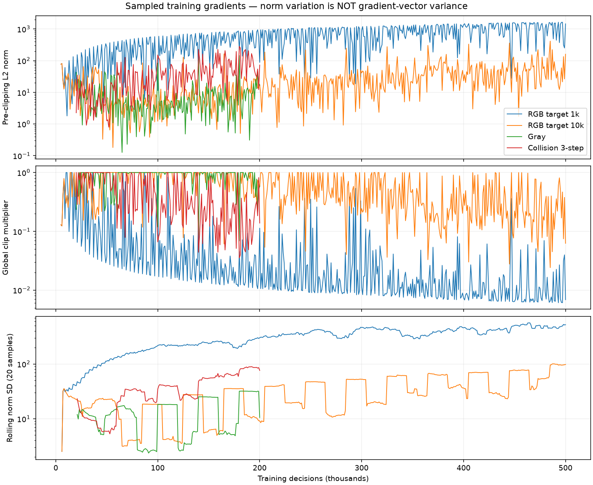
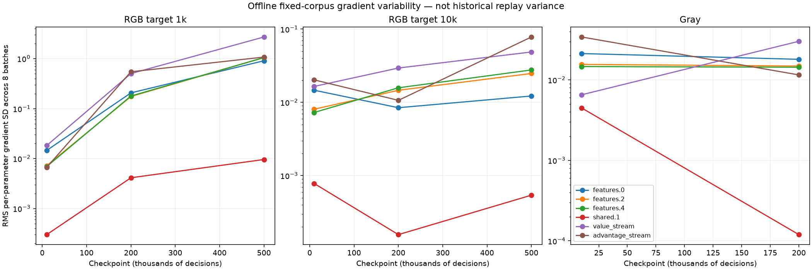

# DDQN reward and gradient audit

## What the learner is rewarded for

Checked the saved `config.json` for both seed-pool runs, both RGB runs, gray,
three-step, and one-step learner seeds 43/44. All eight have
`reward_shaping.enabled=false`. The new T4 confirmation driver also sets
`shaping=False` explicitly.

| Component | Active in these runs | Optional implementation |
|---|---|---|
| Surviving | +1 per native survival frame; usually +4 per decision | Shaping replaces this with `0.01 * native_frames_advanced` by default |
| Death | No explicit negative reward; terminal target has no bootstrap | `-1.0` once on termination when shaping enabled |
| Game-score residual | None | `1.0 * max(0, score_delta - 0.5 * shattered_delta)` |
| Shattered-enemy score | None | `0.0 * 0.5 * shattered_delta` by default |
| Wall/edge proximity | None | `edge_penalty=0.5` exists in config/UI, but is not used by the trainer formula |
| Distance from hazards | None | No distance-based term in this trainer |
| Movement, inactivity, chosen action | None | No corresponding term in this trainer |
| Picking up powerups | No direct reward | Can contribute through the optional score residual; not an explicit pickup-event term |
| Kills | No direct reward | Optional score/shattered terms are proxies, not a verified attribution of agent-caused kills |

Native reward is the unsigned difference in survival-frame counters. The terminal
decision can receive fewer than four survival frames, including zero. It cannot
receive a negative native reward.

Enabling shaping is **not** just enabling a death penalty. It replaces native
reward with a different survival scale and score terms. At default weights:

```text
r = 0.01 * frames_advanced
    + max(0, positive_score_delta - 0.5 * positive_shattered_delta)
    - 1.0 * terminated
```

`frames_advanced` and survival-counter delta are distinct native quantities,
particularly at termination. A controlled death-penalty experiment must preserve
the survival term and hold every other reward component fixed.

The reward module's description promises file-based per-episode reload. This
runner instead constructs its weights from `RewardConfig()` defaults and CLI
overrides once. A slider/config value does not establish an active reward.

Game score is separate from learner reward: freeze/shrink pickups add one;
the explosive-powerup loop adds one per visited enemy entry; the enemy-shatter
scoring path adds 0.5. Do not infer a clean pickup/kill reward from the score
residual alone.

Sources: [native reward](../native/crates/dodge-batch/src/lib.rs),
[training formula](../src/dodge_native_game/variants/cnn_image_ddqn/run.py),
[optional weights](../src/dodge_native_game/variants/cnn_image_ddqn/rewards.py),
[game score events](../native/crates/dodge-core/src/game.rs).

## Measured training gradients



| Run | Sampled updates | Median pre-clip norm | Maximum | Sampled share clipped | Median clip multiplier |
|---|---:|---:|---:|---:|---:|
| RGB, target 1k | 496 | 607.02 | 1641.40 | 97.98% | 0.0165 |
| RGB, target 10k | 496 | 18.55 | 414.48 | 66.33% | 0.5392 |
| Gray | 181 | 5.57 | 145.56 | 27.62% | 1.0000 |
| Collision, three-step | 181 | 30.76 | 282.68 | 75.14% | 0.3251 |

These are sampled optimizer updates, not every update. Duplicate logged samples
are removed by diagnostic optimizer-step ID. The rolling curve is the sample
standard deviation of the last 20 **norms**, not gradient-vector variance.

Clipping uses one global L2 limit of 10. Its pre-Adam multiplier is
`min(1, 10 / (norm + 1e-6))`. Adam's eventual parameter update is not reduced by
that same factor in general. The loss already uses SmoothL1/Huber with beta 1;
large TD errors have bounded loss derivative with respect to predicted Q, while
the network Jacobian can still produce large parameter gradients.

## Layer gradients and variance across checkpoints



Replayed 128 native-pixel transitions from four fixed diagnostic seeds, then
evaluated each saved pixel checkpoint on eight fixed, disjoint batches of 16.
RGB and grayscale use the same transitions. No optimizer updates, training
replay reads, or live GPU instrumentation occurred.

For each parameter tensor and batch-mean gradient `g_b`, the audit records
`sqrt(mean_j Var_b(g_b[j]))`, using unbiased variance across eight batches.
It also records RMS mean gradient, mean batch L2 norm, and the fraction of
parameters with exactly zero gradient in every batch. This is a small,
random-action **diagnostic distribution**, not historical training-replay
gradient variance. Checkpoint intervals are sparse; lines connect measurements,
not observations of the intervening trajectory. Gray's 10k checkpoint is
untrained because its warmup is 20k; RGB's warmup is 5k.

At RGB/target-1k's final checkpoint:

- 62/64 final convolutional channels were silent across the observation corpus.
- 99.51% of final convolution weights had zero gradient in all diagnostic batches.
- The remaining gradients produced a mean global norm of 1362.37 on those batches.
- Final-convolution RMS gradient standard deviation grew from 0.00692 at 10k
  to 0.17865 at 200k and 1.04954 at 500k on this fixed protocol.

RGB/target-10k also had 61/64 silent final channels and 99.36% zero-gradient
final-convolution weights at 500k. Gray at 200k had 28/64 silent final channels
and 77.78% zero-gradient final-convolution weights. Silence on a finite corpus
does not prove a unit is permanently dead.

The evidence supports simultaneous feature inactivity and large gradients in
the remaining pathways. It does not establish that clipping caused collapse,
or that a larger network or different activation will fix it. The three-step
collision run also clips frequently, despite stronger survival performance;
clipping frequency alone is not a failure criterion.

## Next controlled comparisons

1. Finish the same-T4 one-step seed-42 control and three-step seed-43/44
   confirmations already launched; seed 44 is queued behind the control because
   only two T4 assignments were available.
2. For native pixels, isolate feature inactivity with a matched activation
   experiment before combining architectural changes. Keep the input, reward,
   initialization policy, update budget, and evaluation protocol explicit.
3. Test a death-only reward change separately. Do not enable all current shaping
   defaults and attribute any difference to death feedback.
4. Consider layer-wise clipping only after comparing layer gradient scales and
   parameter-update/weight ratios. It separates tensor scales, not death from
   other semantic events. No clipping or reward settings were changed in live jobs.

Three-step returns use `r0 + gamma*r1 + gamma^2*r2 + gamma^3*Q_bootstrap`.
They propagate observed consequences across up to three decisions (12 native
frames here), stopping the reward window at an episode boundary. They are not
lookahead search and do not hold one action for three decisions. Termination
removes bootstrap; time-limit truncation retains it in the three-step path.

Reproduction:

```bash
OMP_NUM_THREADS=1 MKL_NUM_THREADS=1 scripts/uv-run python scripts/ddqn-pixel-collapse-audit.py --output analysis/DDQN_PIXEL_COLLAPSE_AUDIT.json
scripts/uv-run python scripts/ddqn-gradient-plots.py
```

Raw evidence: [activation and gradient audit](DDQN_PIXEL_COLLAPSE_AUDIT.json),
[sampled-gradient summary](DDQN_GRADIENT_SUMMARY.json).
Neither script adds work to the training loop.

## Follow-up defects (not silently fixed)

The legacy quality gate can report pass for a single-action greedy policy because
its action-balance check uses exploratory training counts. New offline checks
cover collapsed evaluation actions, missing diagnostics, and inner-only
checkpoint selection; integration into report publication remains pending.
The reward UI/formula mismatch also needs a separate contract fix. Existing
historical reports and the user's dashboard edits were preserved.
