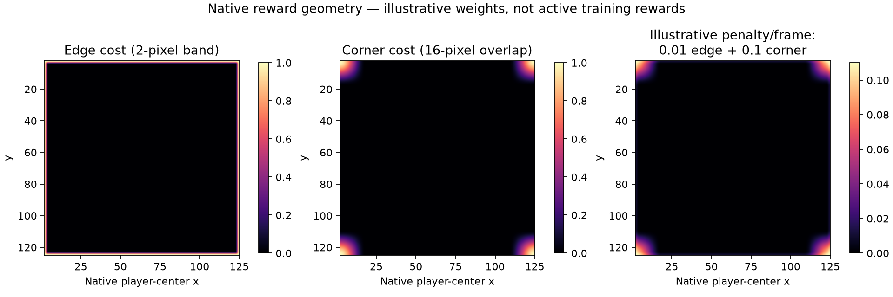

# Native reward foundation

The native foundation is implemented. It does **not** enable shaped rewards in
training. The existing survival reward and pixel observations remain unchanged.

## Implemented

- Native pickup event at actual collection of explosive, freeze, and shrink
  powerups. An explosion destroying other powerups does not collect them.
- `powerups_collected`: owned per-lane counts in the canonical batch/Python
  boundary. Multiple events remain multiple counts; the old event bits keep
  their meanings. Minimal `PixelResult` is unchanged.
- `native_powerups_collected` in variant environment info when the native
  payload provides it. Missing data is omitted, not fabricated as zero.
- Native boundary-cost function with validated finite inputs, bounded outputs,
  smooth edge/corner bands, symmetry, and a flat interior.
- Native signed reward-component arithmetic, with explicit nonnegative weights
  and validation. It accepts per-decision event counts; it is not yet connected
  to the training transition collector.

## Boundary shape



The plot calls the Rust function through PyO3; it does not duplicate geometry
in Python. Native player-center bounds are 2 through 125 on each axis. The
example uses a two-pixel edge band and a 16-pixel corner band. A smooth union
combines the straight-edge costs; the product of the wider bands activates
only near two adjacent sides.

The combined panel uses illustrative costs of 0.01 per frame at an edge and
0.1 per frame at a corner. These are **not enabled experiment weights**.
There is no center bonus. A route three pixels inward from a straight side
has zero spatial cost until it approaches a corner.

The component helper currently defines spatial cost as decision-end field
value times native frames advanced, not an integral over intermediate frames.
That distinction must remain explicit in the experiment manifest.

## Verification and limits

Native tests cover all three pickup types, explosion non-collection, multiplicity,
legacy event bits, field symmetry/bounds/monotonicity, invalid inputs, unchanged
survival scaling, and signed weighted component arithmetic. Existing native
trace, snapshot, rendering, and RNG tests remain part of regression verification.
Python tests exercise the rebuilt extension, owned pickup arrays, and unchanged
base reward. The standard 32-step CPU smoke remains survival-only.

Verification passed: 85 Rust unit tests, 186 Python tests, workspace Clippy with
warnings denied, repository Ruff, and the 32-step CPU smoke.

No reward experiment has been launched from this code. No overhead improvement
or training improvement is claimed. The new pickup payload adds a small count
and array allocation to canonical batch calls; its overhead still needs the
matched benchmark before promotion.

## Next gate

1. Connect exact native death/destruction counts and spatial terms to an opt-in,
   versioned reward profile. Do not use the legacy score residual as a pickup
   signal or silently enable legacy shaping defaults.
2. Record immutable weights, component totals, reward-profile resume compatibility,
   and survival-only evaluation. Verify pixel equality on matched action traces.
3. Measure overhead; then run separate death-only, event-bonus, and boundary
   comparisons at 10k/200k before combined 500k confirmation.
4. Add bounded enemy-clearance shaping as a separate treatment, not part of
   the first reward bundle. Broader visual-corpus/architecture diagnostics and
   learning-quality gate integration remain separate work.

All three T4 confirmation artifacts have now been collected, and both assigned
GPUs released. Those runs used the old survival-only reward; they are not
evidence for any change described here.

Reproduce the field with:

```bash
scripts/uv-run python scripts/ddqn-reward-boundary-plot.py
```
